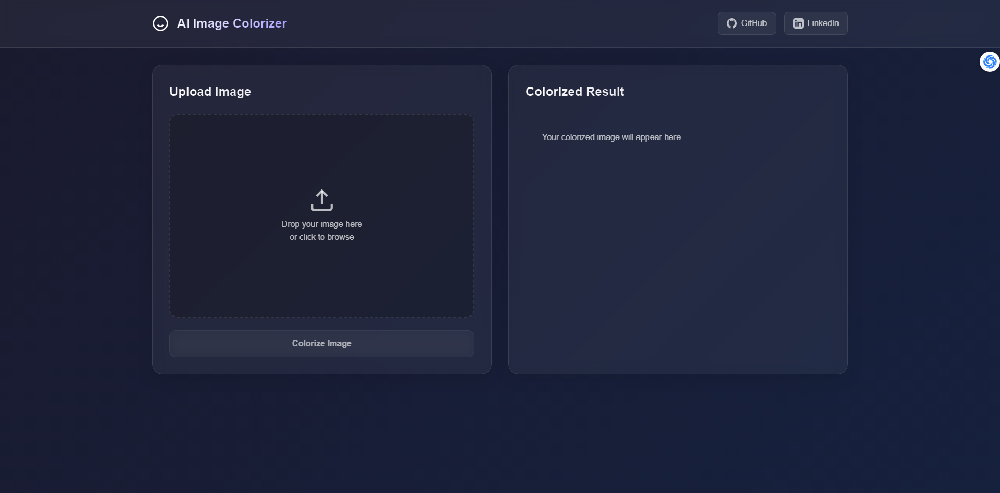
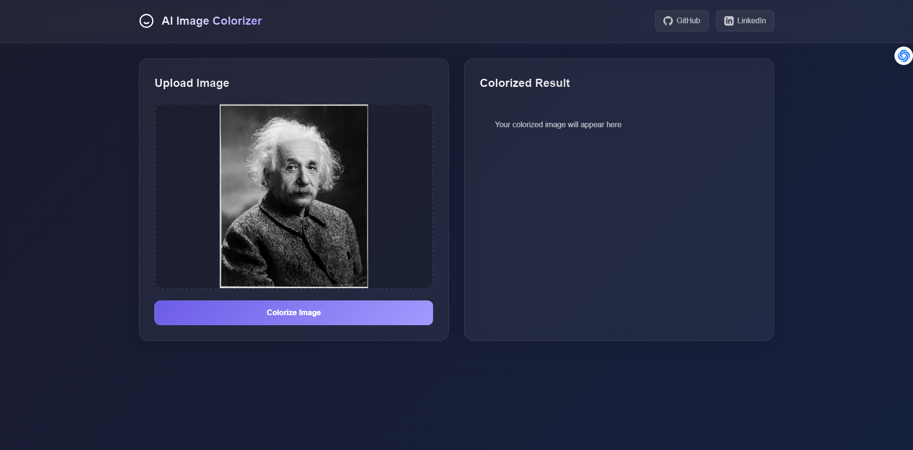
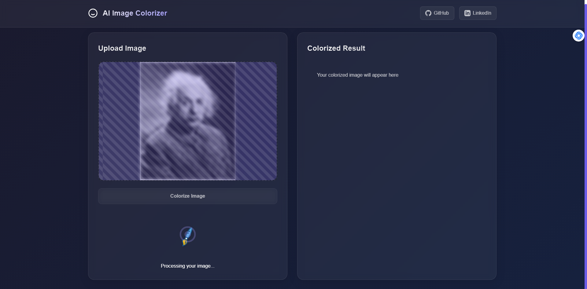
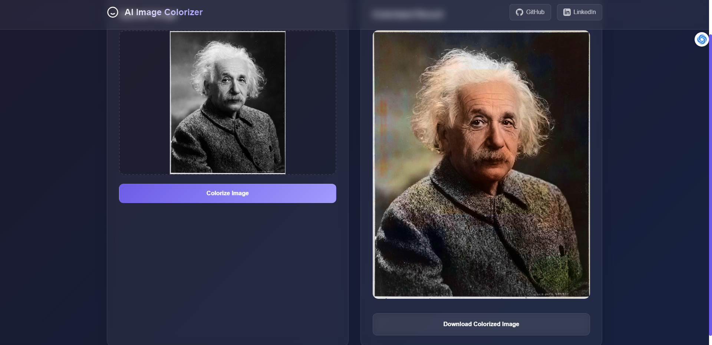
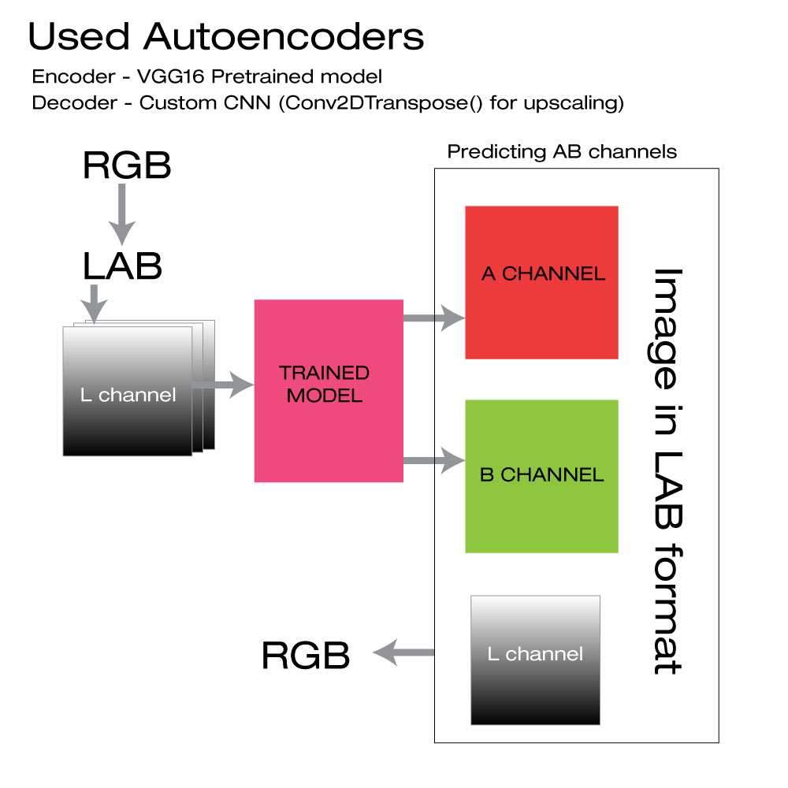

# AI Image Colorizer 🎨


A sophisticated web application that transforms black and white images into vibrant, colorized versions using advanced deep learning techniques. The application intelligently detects image content and applies specialized colorization models for portraits and landscapes.

## Features ✨

- Automatic content-aware colorization
- Specialized processing for portraits and landscapes
- Real-time processing feedback with animated brush effect
- Support for multiple image formats (JPG, PNG, JPEG)
- Advanced color enhancement and blending
- User-friendly interface with drag-and-drop support
- Instant download of colorized images

## Screenshots 📸

### Home Interface


*Clean, intuitive interface with drag-and-drop functionality*

### Processing Animation



### Portrait Colorization

*Example of portrait colorization with enhanced facial details*

### Landscape Colorization
<!--  -->

<div style="display: flex; gap: 10px;">
    
    
</div>
*Example of landscape colorization with natural color reproduction* 


## Technology Stack 🛠

- **Backend**: Flask, Python
- **Image Processing**: OpenCV, NumPy
- **AI Models**: 
  - YOLO for object detection
  - Custom Keras models for colorization
  - MediaPipe for segmentation
- **Frontend**: HTML5, CSS3, JavaScript

## Datasets Used in the project
- **Base Dataset**: pascal-voc-2012-dataset
- **Portrait Dataset**: CelebA-HQ, FFHQ, Unsplash
- **Landscape Dataset**: https://huggingface.co/datasets/mertcobanov/nature-dataset
- **Unsplash Images**

# How Image is colorizing

 
## Installation 💻

1. Clone the repository:
```bash
git clone https://github.com/RajatJain2003visual/AI_ImageColorization.git
cd AI_ImageColorization
```

2. Create and activate virtual environment:
```bash
python -m venv venv
source venv/Scripts/activate ```

3. Install dependencies:
```bash
pip install -r requirements.txt
```

4. Download required models to `models` directory:
- yolo11n.pt
- yolo11n-pose.pt
- finetuned_unsplash_1500_epoch8.keras
- finetuned_landscape5.keras
- pascal_voc_colorize_model_epoch_10.keras
- selfie_multiclass_256x256.tflite

5. Create required directories:
```bash
mkdir -p static/temp static/uploads
```

6. Run the application:
```bash
python app.py
```

7. Open `http://localhost:5000` in your browser

## Usage 📝

1. Open the website in your browser
2. Drop an image or click to select one
3. Wait for the colorization process to complete
4. Download your colorized image

## Project Structure 📁

```
ai-image-colorizer/
├── app.py
├── requirements.txt
├── README.md
├── models/
│   ├── yolo11n.pt
│   ├── yolo11n-pose.pt
│   └── ...
├── static/
│   ├── temp/
│   └── uploads/
└── templates/
    └── index.html
```

## Technical Details 🔧

- Uses LAB color space for natural color blending
- Implements adaptive saturation and vibrance enhancement
- Features intelligent portrait detection and segmentation
- Employs multiple AI models for optimal results
- Includes error handling and cleanup procedures

## Performance Optimization 🚀

- Efficient image processing pipeline
- Optimized model loading and inference
- Automatic cleanup of temporary files
- Responsive design for all screen sizes

## Contributing 🤝

Contributions are welcome! Please feel free to submit a Pull Request.

## License 📄

This project is licensed under the MIT License

## Acknowledgments 🙏

- YOLO for object detection
- MediaPipe for segmentation
- Flask community for web framework
- OpenCV for image processing

### Contact & Project Links

[](mailto:rajatofficial5940@gmail.com)
[](https://github.com/RajatJain2003visual/AI_ImageColorization)
[](https://www.linkedin.com/in/rajat-jain-29a04b236/)
[](https://colab.research.google.com/drive/1Jpgxu8jFPNYUSxVSQn2-XK3utF231r9d?usp=sharing)


---
